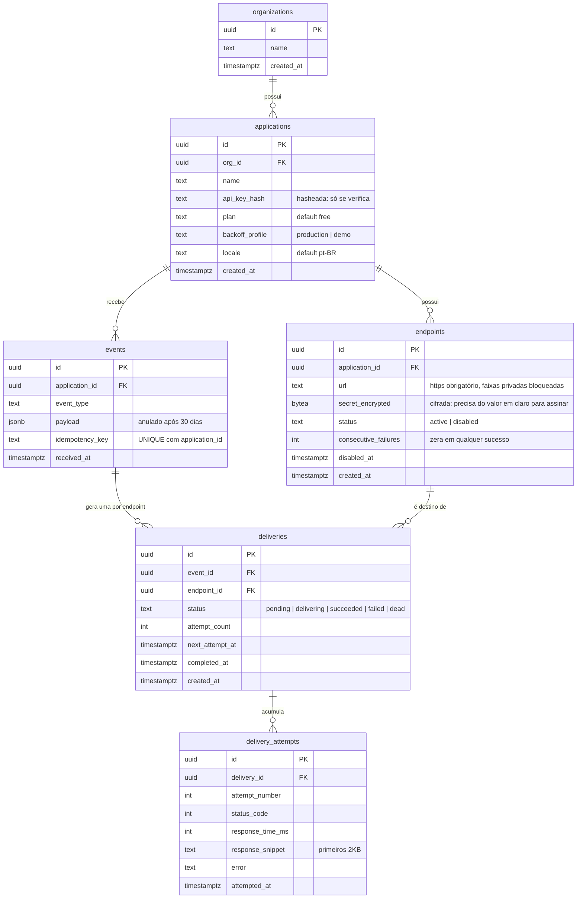

# Modelo de dados

Decisões que explicam esta forma: [`ARCHITECTURE.md` §4.5](../ARCHITECTURE.md) (modelagem em três níveis) e §4.14 (multi-tenancy).

## O que a forma está dizendo

**Três níveis, não um.** `event` é o que aconteceu, `delivery` é para quem, `delivery_attempt` é cada POST. Colapsar isso obrigaria a duplicar payload por destino e destruiria a pergunta que o painel precisa responder: "esse evento chegou em 3 dos 4 endpoints?".

**`dead` é estado separado de `failed`.** O replay manual só faz sentido a partir da DLQ, e essa distinção é o que permite a interface oferecer o botão apenas onde ele se aplica.

**Duas credenciais guardadas de formas diferentes.** `api_key_hash` é hasheada porque só se verifica se bate; `secret_encrypted` é cifrada porque o vhook precisa do valor em claro para calcular o HMAC. Não é inconsistência — é a diferença entre verificar e usar.

**`delivery_attempts` é a tabela que cresce mais rápido.** Retenção de 30 dias, e o degrau de particionamento por mês está em §4.27.
