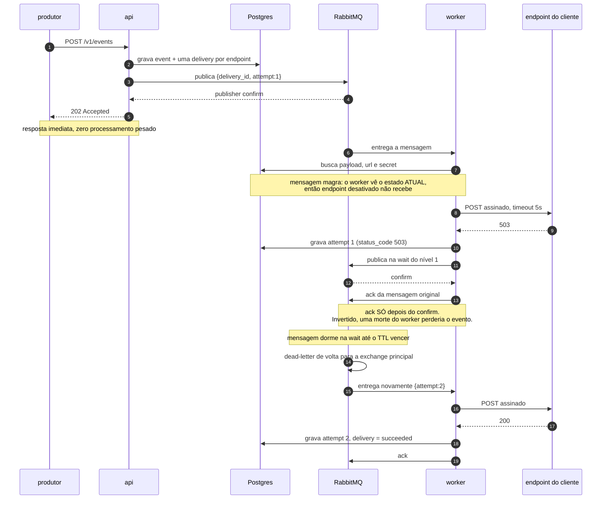
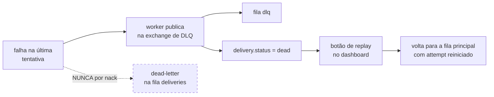

# Vida de uma entrega

Do ingress até a DLQ, com uma falha no meio. Decisões relacionadas: [`ARCHITECTURE.md`](../ARCHITECTURE.md) §4.2 (escada de retry), §4.4 (ordem de ack), §4.6 (mensagem magra).

## Quando as tentativas esgotam

O caminho pontilhado é o erro que parece natural: configurar `x-dead-letter-exchange` na fila `deliveries`. Ele colidiria com a escada de espera e mandaria a mensagem para a DLQ **na primeira falha**, não na última — sem lançar erro nenhum. Ver §4.3.

## O que não aparece aqui

**Falha permanente não passa pela escada.** Um 4xx (exceto 408 e 429) vai direto para `failed`, sem retry: o cliente está rejeitando de propósito, e insistir só queima worker.

**O reconciliador é o caminho de exceção.** Se o publish falhar ou o worker morrer deixando `delivering` pendurado, a linha em `deliveries` continua no Postgres e é republicada. Ver §4.20.
